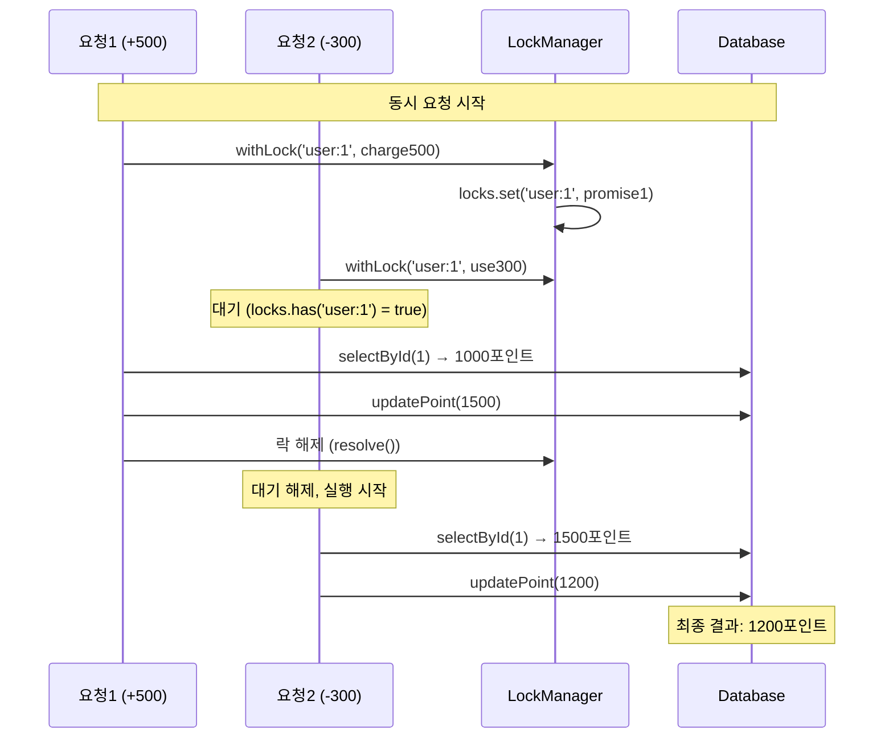

# 포인트 시스템 동시성 제어 분석 보고서

## 문제 정의

### Race Condition 발생 상황

포인트 시스템에서 **동일한 사용자에 대한 동시 요청**이 발생할 때, 데이터 무결성이 깨질 수 있는 문제가 존재합니다.

### 구체적 문제 시나리오

```typescript
// 현재 사용자 잔액: 1000포인트
// 동시에 발생하는 두 요청
Request A: 500포인트 충전
Request B: 300포인트 사용

// 예상 결과: 1000 + 500 - 300 = 1200포인트
// 실제 결과: 700포인트 (데이터 손실 발생!)
```

### 문제의 근본 원인

- **Read-Modify-Write 패턴**에서 발생하는 전형적인 동시성 이슈
- 트랜잭션 간격 사이에 다른 트랜잭션이 끼어들어 데이터 덮어쓰기 발생

---

## 동시성 문제 시나리오

### 타임라인 분석

| 시간 | Request A (충전)        | Request B (사용)        | 데이터베이스 상태 |
| ---- | ----------------------- | ----------------------- | ----------------- |
| T0   | -                       | -                       | 잔액: 1000        |
| T1   | `getUserPoint()` → 1000 | `getUserPoint()` → 1000 | 잔액: 1000        |
| T2   | 계산: 1000 + 500 = 1500 | 계산: 1000 - 300 = 700  | 잔액: 1000        |
| T3   | `updatePoint(1500)`     | -                       | 잔액: 1500        |
| T4   | -                       | `updatePoint(700)`      | **잔액: 700** ❌  |

### 문제 발생 패턴

1. **Lost Update**: 나중에 실행된 트랜잭션이 이전 결과를 덮어씀
2. **Dirty Read**: 커밋되지 않은 데이터를 읽어서 잘못된 계산
3. **Non-Repeatable Read**: 같은 트랜잭션 내에서 동일한 데이터가 다르게 조회

---

## 해결 방안 분석

### 고려한 해결 방식들

| 방식                             | 장점                     | 단점                     | 적용 가능성 |
| -------------------------------- | ------------------------ | ------------------------ | ----------- |
| **비관적 락 (Pessimistic Lock)** | 완벽한 데이터 일관성     | 성능 저하, 교착상태 위험 | 🔶 중간     |
| **낙관적 락 (Optimistic Lock)**  | 높은 성능, 교착상태 없음 | 충돌 시 재시도 복잡성    | 🔶 중간     |
| **큐 기반 순차 처리**            | 구현 단순, 순서 보장     | 처리량 제한, 확장성 부족 | 🔴 낮음     |
| **메모리 락 (In-Memory Lock)**   | 빠른 처리, 단순 구현     | 단일 인스턴스 제한       | 🟢 높음     |

## 선택한 해결책

### MemoryLockManager 기반 동시성 제어

**선택 이유:**

- ✅ **단순성**: 복잡한 외부 의존성 없이 구현 가능
- ✅ **효율성**: 메모리 기반으로 빠른 락 처리
- ✅ **요구사항 부합**: "분산 환경 고려하지 않음" 조건에 적합
- ✅ **테스트 용이성**: Mock 없이 실제 동작 검증 가능

### 핵심 설계 원칙

1. **사용자별 격리**: `user:${userId}` 키로 사용자별 독립적 락
2. **순차 처리**: 동일 사용자의 요청은 순서대로 처리
3. **병렬 처리**: 서로 다른 사용자는 동시 처리 가능
4. **안전한 해제**: finally 블록으로 예외 상황에서도 락 해제 보장
5. **확장성 고려**: 추후에 다른 manager로 lock 알고리즘을 교체할 수 있도록 보장

---

## 구현 방식

### MemoryLockManager 구현

```typescript
@Injectable()
export class MemoryLockManager {
  private locks = new Map<string, Promise<void>>();

  async withLock<T>(key: string, operation: () => Promise<T>): Promise<T> {
    // 1단계: 기존 락 대기
    while (this.locks.has(key)) {
      await this.locks.get(key);
    }

    // 2단계: 새로운 락 생성
    let resolve: () => void;
    const lockPromise = new Promise<void>((r) => (resolve = r));
    this.locks.set(key, lockPromise);

    try {
      // 3단계: 비즈니스 로직 실행
      return await operation();
    } finally {
      // 4단계: 락 해제
      this.locks.delete(key);
      resolve!();
    }
  }
}
```

### 서비스 레이어 적용

```typescript
@Injectable()
export class PointService {
  constructor(
    private readonly userPointTable: UserPointTable,
    private readonly pointHistoryTable: PointHistoryTable,
    private readonly lockManager: MemoryLockManager,
  ) {}

  async chargePoint(userId: number, amount: number): Promise<UserPoint> {
    return this.lockManager.withLock(`user:${userId}`, async () => {
      // 동시성 안전한 포인트 충전 로직
      const userPoint = await this.userPointTable.selectById(userId);
      const chargedPoint = userPoint.point + amount;

      await this.userPointTable.insertOrUpdate(userId, chargedPoint);
      await this.pointHistoryTable.insert(/* ... */);

      return { id: userId, point: chargedPoint, updateMillis: Date.now() };
    });
  }
}
```

### 동작 플로우



---

## 테스트 결과

### 동시성 테스트 케이스

#### 동시 충전 요청 테스트

```typescript
it('동시 충전 요청이 정상적으로 처리되어야 한다', async () => {
  const requestPromise = [
    service.chargePoint(1, 1000),
    service.chargePoint(1, 500),
    service.chargePoint(1, 300),
  ];

  await Promise.all(requestPromise);

  const result = await service.getUserPoint(1);

  expect(result.point).toBe(1800);
});
```

#### 동시 사용 요청 테스트

```typescript
it('동시 사용 요청이 정상적으로 처리되어야 한다', async () => {
  await service.chargePoint(1, 10000);

  const requestPromise = [
    service.usePoint(1, 1000),
    service.usePoint(1, 500),
    service.usePoint(1, 300),
  ];

  await Promise.all(requestPromise);

  const result = await service.getUserPoint(1);

  expect(result.point).toBe(8200);
});
```

#### 동시 충전/사용 요청 테스트

```typescript
it('충전/사용 혼합 요청이 정상적으로 처리되어야 한다', async () => {
  await service.chargePoint(1, 10000);

  const requestPromise = [
    service.usePoint(1, 1000),
    service.chargePoint(1, 500),
  ];

  await Promise.all(requestPromise);

  const result = await service.getUserPoint(1);

  expect(result.point).toBe(9500);
});
```

## 향후 확장 방안

lock manager의 interface만 맞추면 구현체는 어떤 것이 와도 문제없음
비즈니스 로직에 lock manager 로직이 녹아있는게 좋은 코드는 아닌 것 같은데, 추후에 AOP로 @Transaction 과 같이 분리하면 좋을 것으로 판단됨

#### Redis 기반 분산 락

```typescript
interface LockManager {
  withLock<T>(key: string, operation: () => Promise<T>): Promise<T>;
}

class RedisLockManager implements LockManager {
  async withLock<T>(key: string, operation: () => Promise<T>): Promise<T> {
    // Redis SETNX를 이용한 분산 락 구현
  }
}
```

#### 데이터베이스 기반 락

```typescript
class DatabaseLockManager implements LockManager {
  async withLock<T>(key: string, operation: () => Promise<T>): Promise<T> {
    // SELECT FOR UPDATE를 이용한 데이터베이스 락
  }
}
```
